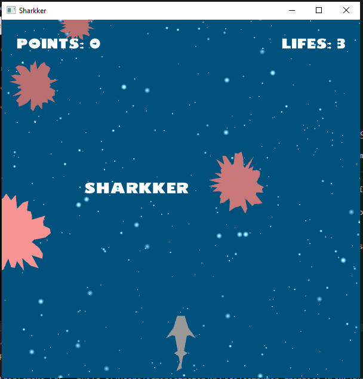

```
  ██████  ██░ ██  ▄▄▄       ██▀███   ██ ▄█▀ ██ ▄█▀▓█████  ██▀███  
▒██    ▒ ▓██░ ██▒▒████▄    ▓██ ▒ ██▒ ██▄█▒  ██▄█▒ ▓█   ▀ ▓██ ▒ ██▒
░ ▓██▄   ▒██▀▀██░▒██  ▀█▄  ▓██ ░▄█ ▒▓███▄░ ▓███▄░ ▒███   ▓██ ░▄█ ▒
  ▒   ██▒░▓█ ░██ ░██▄▄▄▄██ ▒██▀▀█▄  ▓██ █▄ ▓██ █▄ ▒▓█  ▄ ▒██▀▀█▄  
▒██████▒▒░▓█▒░██▓ ▓█   ▓██▒░██▓ ▒██▒▒██▒ █▄▒██▒ █▄░▒████▒░██▓ ▒██▒
▒ ▒▓▒ ▒ ░ ▒ ░░▒░▒ ▒▒   ▓▒█░░ ▒▓ ░▒▓░▒ ▒▒ ▓▒▒ ▒▒ ▓▒░░ ▒░ ░░ ▒▓ ░▒▓░
░ ░▒  ░ ░ ▒ ░▒░ ░  ▒   ▒▒ ░  ░▒ ░ ▒░░ ░▒ ▒░░ ░▒ ▒░ ░ ░  ░  ░▒ ░ ▒░
░  ░  ░   ░  ░░ ░  ░   ▒     ░░   ░ ░ ░░ ░ ░ ░░ ░    ░     ░░   ░ 
      ░   ░  ░  ░      ░  ░   ░     ░  ░   ░  ░      ░  ░   ░     
   (                                                        
    /(                                                      
   #///#                         #/&                        
     .//%                         #///&  .#&#((((#&%.       
      #//%                        .&///////((///////////#   
      *///%                    &////*..(////////#/((///#(%  
      ,////%              .%///(//%.,@.................*//,.
      #///(////((//////////////((/(..(@&/.................,.
     #////(.#//////////////////#/(,...*/@@@ ,*///,,..,*%/*.%
    ////%      #/////////////////*....../.*@@@@@@@@@@@@@(.# 
  (//#          ,(#//////////////...........**/., *.#/...%  
,*                  #////////////*......................(   
                     /////(((((///....................#     
                          %////#.....................%      
                        %///& /%,................#....%     
                      #//&             ,.,,..      (...&    
                    ((%                              /..@   
                  %                                    ..   
                                                        (#  
```
#                            SHARKKER
<https://matheusr42.github.io/computer-graphics-UFABC/sharkker/>
    <https://github.com/MatheusR42/computer-graphics-UFABC>
                        Release 2021/10/31

by  **Matheus Araujo**      *<https://github.com/MatheusR42>*   matheus.victor@aluno.ufabc.edu.br
&&  **Giovanne Galdino**    *<https://linktr.ee/galdino.gio>*   giovanne.galdino@aluno.ufabc.edu.br

                            UFABC
                    Univesidade Federal do ABC
                    
                MCTA008-17 ♦ Computação Gráfica 
                Prof. Bruno Augusto Dorta Marques

=============
## ABCg
Development framework accompanying the course MCTA008-17 Computer Graphics at [UFABC](https://www.ufabc.edu.br/).
### Credits
 Developed by Harlen Batagelo.
### License
ABCg is licensed under the MIT License. See [LICENSE](https://github.com/hbatagelo/abcg/blob/main/LICENSE) for more information.
=============

## Game
Sharkker é um jogo 2D desenvolvido com base no jogo [Asteroids](https://hbatagelo.github.io/abcgapps/asteroids/index.html) utilizado na disciplina de Computação Gráfica MCTA008-17 da UFABC. A ideia inicial era se inspirar nos jogos Frogger (SEGA/Konami, 1981) e Space Impact (Nokia, 2000).
Foi utilizado o OpenGL como API gráfica, com programação em C++ e framework ABCg também desenvolvido para acompanhamento da disciplina de CG.

O objetivo do jogo é guiar adiante um tubarão pelo vasto oceano, enquanto grandes fragmentos de corais tentam atingí-lo.
Conforme o animal avança e desvia dos obstáculos, são somados pontos ao canto superior esquerdo da tela.
Caso o tubarão colida com algum coral, ele se machucará e perderá uma de suas três vidas, indicadas no canto superior esquerdo. Ao chegar à zero, o jogo acaba.


Conforme o tubarão avança, o nível de dificuldade aumenta, com maior geração de corais e maior velocidade. Porém, essa dificuldade é limitada à um nível justo de jogabilidade.
Não há um final para esse jogo e o objetivo é ir o mais longe possível, somando mais pontos.

## Jogar
É possível jogar Sharkker a partir do primeiro link deste markdown em WebAssembly no GitHub Pages ou fazer um build seguindo a seguinte documentação: https://hbatagelo.github.io/cg/config.html

## Comandos
← Mover para a esquerda
→ Mover para a direita

## Objetos
### Shark
Sharkker acompanha a trajetória de um tubarão tigre *(Galeocerdo cuvier)*, comum em toda a costa brasileira. Esse tipo de esqualo pode chegar até 9 metros de comprimento. O jogo se desenvolve em algum lugar entre o litoral nordestino continental e a ilha de Fernando de Noronha. 
Pouco se sabe sobre a motivação do animal, seu passado e seus objetivos. Não conhecemos a personalidade dele, seu nível de agressidade ou o porquê ele está naquela situação.
A cultura humana nos leva à acreditar que tubarões são animais perigosos e violentos. Porém, vemos seu habitat ser constantemente ameaçado. Então, que escolha eles têm?

Assim como a nave de Asteroids, o animal é desenhado com vértices que se ligam em vários triângulos.
Abaixo, vemos como se deu o passo-a-passo de sua criação:


### Corals
Os corais são gerados com um número aleatório de vértices entre 50 e 70.
Possuem também certa aleatoriedade na posição nos quais são gerados na parte superior da tela, nas suas velocidades de rotação, tamanho e intensidade de cor. Após passarem completamente pela borda inferior da tela um ponto é contabilizado e o caral é destruido para liberar espaço na memória.


### Bubbles and Ocean
A cor do oceano, ao fundo de todos os objetos, foi baseada justamente na cor "Ocean Blue" #006994 (de palheta R000 G105 B148). Porém, há um leve escurecimento para melhor contraste com os outros componentes do jogo.
Já as camadas de bolhas, seus gradientes e mecânicas foram herdadas das stars do jogo Asteroids.


## Features
• Sistema de pontuação
• Sistema de vidas
• Invencibilidade momentânea ao perder cada uma das duas primeiras vidas
• Aumento de velocidade da tela do jogo conforme progressão
• Aumento da quantidade de corais conforme progressão
• Display do título do jogo, game over e créditos
• Tubarão criado manualmente
• Corais criados aleatoriamente com movimento rotacional e em direção ao player


----

