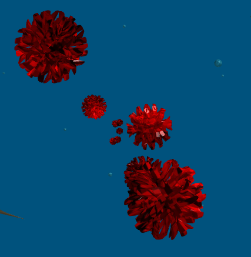

```
  ██████  ██░ ██  ▄▄▄       ██▀███   ██ ▄█▀ ██ ▄█▀▓█████  ██▀███  
▒██    ▒ ▓██░ ██▒▒████▄    ▓██ ▒ ██▒ ██▄█▒  ██▄█▒ ▓█   ▀ ▓██ ▒ ██▒
░ ▓██▄   ▒██▀▀██░▒██  ▀█▄  ▓██ ░▄█ ▒▓███▄░ ▓███▄░ ▒███   ▓██ ░▄█ ▒
  ▒   ██▒░▓█ ░██ ░██▄▄▄▄██ ▒██▀▀█▄  ▓██ █▄ ▓██ █▄ ▒▓█  ▄ ▒██▀▀█▄  
▒██████▒▒░▓█▒░██▓ ▓█   ▓██▒░██▓ ▒██▒▒██▒ █▄▒██▒ █▄░▒████▒░██▓ ▒██▒
▒ ▒▓▒ ▒ ░ ▒ ░░▒░▒ ▒▒   ▓▒█░░ ▒▓ ░▒▓░▒ ▒▒ ▓▒▒ ▒▒ ▓▒░░ ▒░ ░░ ▒▓ ░▒▓░
░ ░▒  ░ ░ ▒ ░▒░ ░  ▒   ▒▒ ░  ░▒ ░ ▒░░ ░▒ ▒░░ ░▒ ▒░ ░ ░  ░  ░▒ ░ ▒░
░  ░  ░   ░  ░░ ░  ░   ▒     ░░   ░ ░ ░░ ░ ░ ░░ ░    ░     ░░   ░ 
      ░   ░  ░  ░      ░  ░   ░     ░  ░   ░  ░      ░  ░   ░     
                                                            
                    %                              .,. . *, 
                    %%                 .,(&%*///(*(#*(,*//% 
                   #%%&           ,,,***,*  ....*(*#%%&&&&  
                   #%%%&///((*/****//..../*.,,,,,,,/%%%%%   
                  #(((((((///*//*,...,(%%%%&%&@@@@@&&%%#    
  \           .(##%#%##(((((..,*,*((%&&@@@@@@@@@@@@@&      
   %        *####%%%%%(#####*//((((&@@@@@@@@@@@@@&@@        
   %&     //(/%/%%((&&/&&(/#/(/%*(/.., .,  .(**@,@          
   %%  %(((#%(((&(&(@&#((//((&(%(((&(&/(%((&&%&&&&%%%       
   &%##%%%&&&&&&%&%&&&&@&&%%%&%%%&&&&&&&&&&&&&&&&&@         
   && &&@&&&&&%%%%&%%###%&%%%%&&&&%&&&&&&&&&/               
  %@  (@   &&&&%%%#((#(@@&&&&&&&&&&&&                       
 %            &((((@           &&&&&@                       
           #%&@                 &&&&@                       
        %@                       @&@                                                              
```
#                            SHARKKER FINAL

https://matheusr42.github.io/computer-graphics-UFABC/sharkkerfinal/
Release 2021/12/08


by  **Matheus Araujo**      *<https://github.com/MatheusR42>*   matheus.victor@aluno.ufabc.edu.br

&&  **Giovanne Galdino**    *<https://linktr.ee/galdino.gio>*   giovanne.galdino@aluno.ufabc.edu.br

```
                             UFABC
                    Univesidade Federal do ABC
                    
                MCTA008-17 ♦ Computação Gráfica 
                Prof. Bruno Augusto Dorta Marques
```
## Game
Sharkker é um jogo tridimensional desenvolvido na disciplina de Computação Gráfica MCTA008-17 da UFABC. 
Foi utilizado o OpenGL como API gráfica, com programação em C++ e framework ABCg também desenvolvido para acompanhamento da disciplina de CG.

Tubarões sobreviveram à quatro das cinco grandes extinções em massa da história. Isso os fazem mais velhos que a humanidade, que a Cordilheira dos Andes, os dinossauros e até as árvores.

O objetivo do jogo é guiar adiante um desses esqualos pelo vasto oceano, enquanto grandes fragmentos de corais tentam atingí-lo.
Conforme o animal avança e desvia dos obstáculos, são somados pontos ao canto superior esquerdo da tela.
Caso o tubarão colida com algum coral, ele se machucará e perderá uma de suas três vidas, indicadas no canto superior direito. Ao chegar à zero, o jogo acaba.


Não há um final para esse jogo e o objetivo é ir o mais longe possível, somando mais pontos.

## Jogar
É possível jogar Sharkker a partir do primeiro link deste markdown em WebAssembly no GitHub Pages ou fazer um build seguindo a seguinte documentação: https://hbatagelo.github.io/cg/config.html

## Comandos
← Mover para a esquerda

→ Mover para a direita

↑ Mover para cima

↓ Mover para baixo


## Objetos
### Shark
Sharkker acompanha a trajetória de um tubarão tigre *(Galeocerdo cuvier)*, comum em toda a costa brasileira. Esse tipo de esqualo pode chegar até 9 metros de comprimento. O jogo se desenvolve em algum lugar entre o litoral nordestino continental e a ilha de Fernando de Noronha em uma época desconhecida. 
Pouco se sabe sobre a motivação do animal, seu passado e seus objetivos. Não conhecemos a personalidade dele, seu nível de agressidade ou o porquê ele está naquela situação.
A cultura humana nos leva à acreditar que tubarões são animais perigosos e violentos. Porém, vemos seu habitat ser constantemente ameaçado. Então, que escolha eles têm?

O modelo 3D em formato .obj do animal foi gratuitamente baixado em [CGTrader](https://www.cgtrader.com/free-3d-models/animals/fish/low-poly-style-shark).


Sua cor foi alterada de forma à manter a tradicional cor acinzentada do tubarão-tigre da série de jogos Sharkker


Conforme movimenta-se, é possível enxergar vários ângulos do esqualo.


### Corals
Os corais são gerados em uma posição aleatória ao final do eixo de profundidade do espaço do jogo e seguem em direção ao tubarão. Ao passarem por ele, soma-se um ponto para cada coral, eles são reaproveitados e posicionados de forma aleatória nas distâncias iniciais novamente. 
Os corais estão sempre rotacionando em direções aleatórias ao redor de seu próprio eixo.

O modelo 3D em formato .obj dos corais foi gratuitamente baixado em [3dmdb](https://3dmdb.com/en/3d-model/spike-ball-by-fabanafabana/8963728/).



### Bubbles and Ocean
A cor do oceano, ao fundo de todos os objetos, foi baseada justamente na cor "Ocean Blue" #006994 (de palheta R000 G105 B148). Porém, há um leve escurecimento para melhor contraste com os outros componentes do jogo.
A mecânica das bolhas foi herdada do código de Starfield e, assim como os corais, além de estarem sempre rotacionando, são geradas aleatóriamente ao final do ângulo de visão e seguem em direção ao tubarão. Ao passar por ele, são reaproveitadas e posicionadas de forma aleatória nas distâncias iniciais novamente.


Houve a tentativa de implementar uma textura ao fundo com o método do Skybox, porém contentou-se em desenvolver o jogo sem ela.


## Features
• Sistema de pontuação

• Sistema de vidas

• Display do título do jogo, game over e créditos

• Tubarão realiza movimentos conforme nada e recebe comandos do jogador.

• Corais e bolhas com movimento rotacional e que progridem em direção ao player de posições aleatórias

• Textura, sombreamento e iluminação nos objetos do jogo.

• Além de ficar vermelho, o tubarão recebe invencibilidade momentânea ao perder cada uma das duas primeiras vidas 


----
## ABCg
Development framework accompanying the course MCTA008-17 Computer Graphics at [UFABC](https://www.ufabc.edu.br/).

### Credits
Developed by Harlen Batagelo.

### License

ABCg is licensed under the MIT License. See [LICENSE](https://github.com/hbatagelo/abcg/blob/main/LICENSE) for more information.
